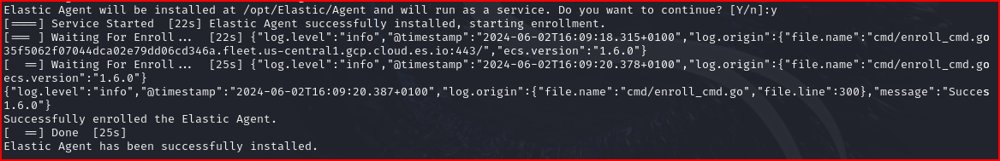
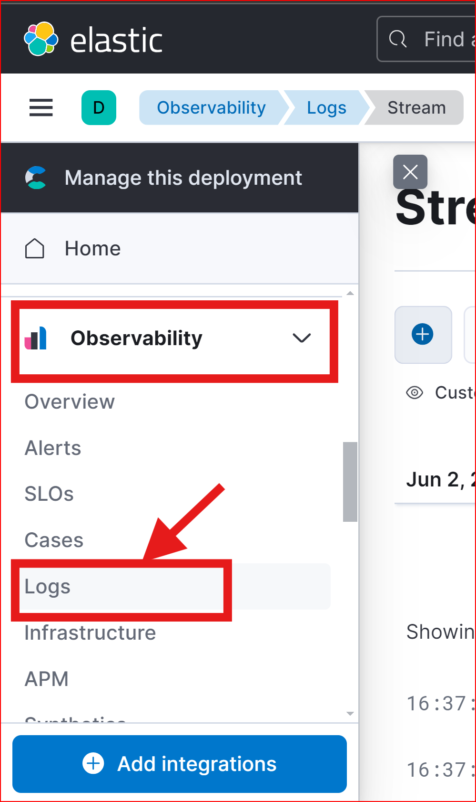
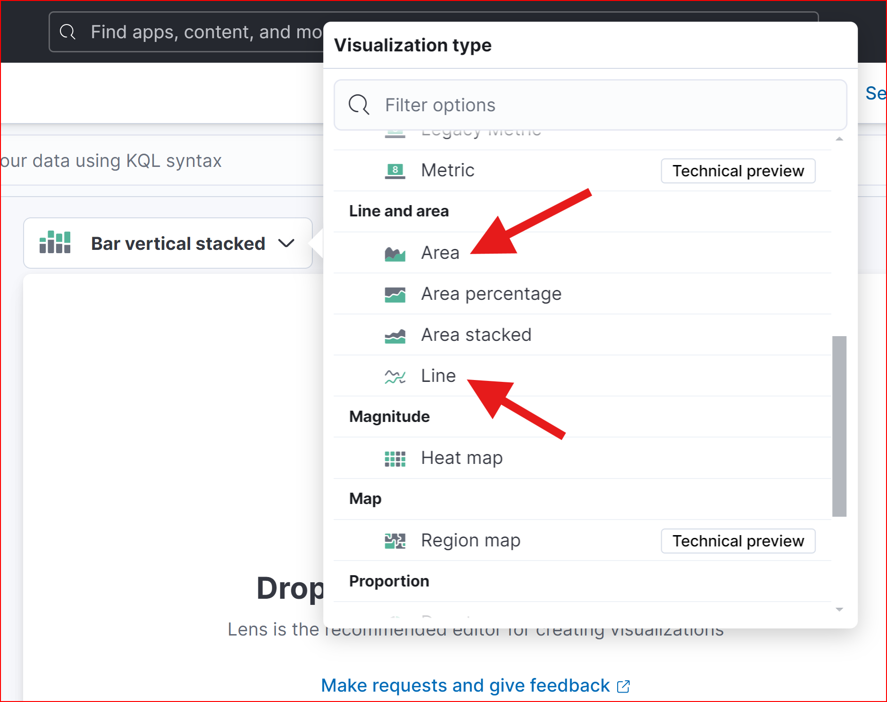
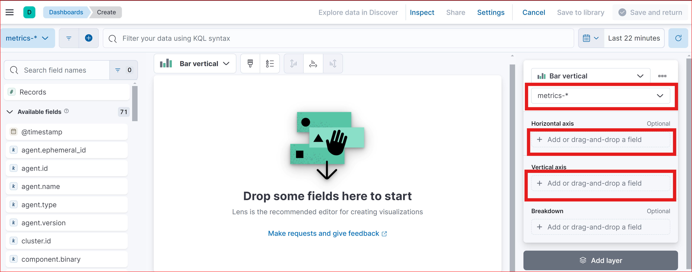

# HOME LAB PROJECT

ELASTIC SIEM HOME LAB PROJECT

**Build a Home SIEM Lab (Elastic SIEM)**

In this guide, you will learn how to set up a home lab for Elastic Stack Security Information and Event Management (SIEM) using the Elastic Web portal and a Kali Linux VM. The guide includes steps to generate security events on the Kali VM, set up an agent to send data to the SIEM, and query and analyse the logs in the SIEM. Completing this project can enhance your resume and provide valuable experience to discuss in interviews.

**Prerequisites:**

Before we get started, make sure you have the following:

-   VirtualBox or VMware
-   Basic knowledge of Linux and virtualization software.

**Overview of the steps:**

1.  Set up a free Elastic account.
2.  Install the Kali VM.
3.  Configure the Elastic Agent on the Linux VM to collect the logs and forward it to the SIEM.
4.  Generate security events on the Kali VM.
5.  Query to find the security events in the Elastic SIEM.
6.  Create a Dashboard to visualize security events.
7.  Create alerts for security events.

**Step 1: Set up an Elastic Account.**

To begin, you need to create a free Elastic Cloud account to run the SIEM. Follow these steps:

1.  Sign up for a free trial at Elastic Cloud.
2.  Log in to the Elastic Cloud console at Elastic Cloud.
3.  Click on “Start your free trial.”
4.  Click “Create Deployment” and choose “Elasticsearch” as the deployment type.
5.  Select a region and deployment size that fits your needs, then click “Create Deployment.”
6.  Wait for the deployment configuration to complete.
7.  Once ready, click “Continue.”

**Step 2: Setting Up the Linux VM**

To set up the Linux VM, follow these steps:

1.  Download the Kali Linux VM from the official Kali website.
2.  Create a new VM using the Kali VM file in your chosen virtualization software, such as VirtualBox or VMware.
3.  Start the VM and follow the installation prompts.
4.  Once the installation is complete, log in using "kali" as both the username and password.

NB: If you encounter difficulties, search for "How to create a virtual machine using VirtualBox/VMware with a Kali VM file" on YouTube for additional guidance.

**Step 3: Setting Up the Agent to Collect Logs**

An agent is software installed on a device to collect and send data to a centralized system for analysis and monitoring. For this home lab project, you'll use an agent to collect and send security-related events from your Kali VM to your Elastic SIEM instance. Follow these steps:

1.  Log in to your Elastic SIEM instance.
2.  Navigate to the Integrations page by clicking on the Kibana main menu at the top left and selecting “Integrations” at the bottom.

1.  Search for “Elastic Defend” and click on it to open the integration page.

1.  Click on “Add Elastic Defend” and follow the on-screen instructions to install the agent on your Kali VM.

1.  Click on “Install Elastic Defend” and follow the instructions provided on the next page.

1.  Under Linux Tar, copy the command, which will be pasted in the Kali terminal.

Make sure to “confirm incoming data” at the Add the Integration stage.

The complete set up Elastic Defend integration complete screen should look something like this:

1.  Past the command into the kali terminal (command line)

1.  After installing the agent, which takes a few minutes, a message will confirm the successful installation. The agent will then start collecting and forwarding logs to your Elastic SIEM instance, though it may take a few minutes for the logs to show up in the SIEM.

You can check if the agent is installed correctly by running the command: \`sudo systemctl status elastic-agent.service\`.

**NB:** If you encounter an error while installing the agent, ensure that your Kali is connected to the internet by pinging google.com before continuing.

**Step 4: Generating Security Events on the Kali VM**

To ensure the agent is functioning properly, you can generate some security-related events on your Kali VM. One way to do this is by using a tool like Nmap. Nmap (Network Mapper) is a free, open-source utility for network exploration, management, and security auditing. It is designed to discover hosts and services on a network, effectively creating a "map" of the network. Nmap can scan hosts for open ports, identify the operating system and software running on the target system, and collect other network-related information.

To run an Nmap scan, follow these steps:

1.  If you're not using Kali, install Nmap on your Linux VM. (Nmap is preinstalled in Kali.) Open a new Terminal and execute the following command to install it: \`sudo apt-get install nmap\`.
2.  To scan the Kali machine, run the command: \`sudo nmap \<vm-ip\>\`. You can also scan your host machine by placing your Kali VM on a “bridged” network.

1.  This scan produces various security events, including the detection of open ports and the identification of services operating on those ports. To generate more data, conduct additional Nmap scans using commands such as “nmap -sS \<ip address\>”, “nmap -sT \<ip address\>”, and “nmap -p- \<ip address\>”.

**Step 5: Query to find the security events in the Elastic SIEM.**

Now that we've successfully forwarded data from the Kali VM to our SIEM system, we can begin querying and analysing the logs within the SIEM for our home lab project.

**To proceed, follow these steps:**

1.  Within your Elastic Deployment, click on the menu icon at the top-left corner (three horizontal lines). Then, navigate to the "Logs" tab under "Observability" to view the logs from the Kali VM.

1.  In the search bar, enter a search query to filter the logs. For example, to find all logs related to Nmap scans, use the query: \`event.action: "nmap_scan"\` or \`process.args: "sudo"\`.
1.  Click the "Search" button to execute the query. Keep in mind that it might take some time for the events to populate and appear in the SIEM, so this query may not work immediately.
1.  The search results will be displayed in the table below. To view more details about a specific event, click on the three dots next to it.

By generating and analysing various types of security events in Elastic SIEM, such as the ones mentioned above, or by intentionally causing authentication failures by typing in the wrong password for a user or attempting SSH logins with an incorrect password, you can gain a deeper understanding of how security incidents are detected, investigated, and responded to in real-world environments.

**Step 6: Create a Dashboard to Visualise the Events**

You can also use the visualizations and dashboards in the SIEM app to analyse logs and identify patterns or anomalies in the data. For instance, you can create a dashboard that displays a count of security events over time.

Here’s how you can do that:

1.  Navigate to the Elastic web portal at [https://cloud.elastic.co/](https://cloud.elastic.co/).
    1.  Click on the menu icon at the top-left corner.
    2.  Under "Analytics," click on "Dashboards."

1.  Click on the "Create dashboard" button at the top right to start a new dashboard.

1.  Click on the "Create Visualization" button to add a new visualization to the dashboard.

1.  Select "Area" or "Line" as the visualization type, based on your preference. This will generate a chart showing the count of events over time.

1.  In the “Metrics” section of the visualization editor on the right, select “Count” as the vertical field type and “Timestamp” as the horizontal field. This will display the count of events over time.

1.  Click the "Save" button to save the visualization, then complete the rest of the settings.

**Step 7: Create an Alert**

In a SIEM, alerts are crucial for detecting security incidents and responding to them promptly. Alerts are created based on predefined rules or custom queries and can trigger specific actions when certain conditions are met. In this task, we will walk through the steps of creating an alert in the Elastic SIEM instance to detect Nmap scans. By following these steps, you can create an alert to monitor your logs for Nmap scan events and notify you when they are detected.

Here are the steps:

1.  Click on the menu icon at the top-left corner, then under “Security,” click on “Alerts.”
    1.  Click on “Manage rules” at the top right.

1.  Click on the "Create new rule" button at the top right.
1.  In the "Define rule" section, select the "Custom query" option from the dropdown menu.
1.  Under "Custom query," set the conditions for the rule. You can use the following query to detect Nmap scan events.

This query will match all events with the action “nmap_scan.” Then click “Continue.”

e) In the "About rule" section, give your rule a name and a description (e.g., Nmap Scan Detection).

f) Set the severity level for the alert to help prioritize alerts based on their importance. Keep all the other default settings under "Schedule rule" and click "Continue."

g) In the "Actions" section, select the action you want to take when the rule is triggered. You can choose to send an email notification, create a Slack message, or trigger a custom webhook.

h) Finally, click the "Create and enable rule" button to create the alert.

Once the alert is created, it will continuously monitor your logs for Nmap scan events. If an Nmap scan event is detected, the alert will be triggered, and the specified action will be executed. You can view and manage your alerts in the "Alerts" section under "Security."

**Conclusion**

In this project, we set up a home lab using Elastic SIEM and a Kali VM. We forwarded data from the Kali VM to the SIEM using the Elastic Beats agent, generated security events on the Kali VM using Nmap, and queried and analysed the logs in the SIEM through the Elastic web interface. We also created a dashboard to visualize security events and set up an alert to detect specific security events.

This home lab offers a valuable environment for learning and practicing skills necessary for effective security monitoring and incident response using Elastic SIEM. By following these steps, you can gain hands-on experience with a SIEM, enhancing your security monitoring skills and helping you become a proficient security analyst or engineer.

**Next Steps**

**1. Generate and Query Different Security Events:** Try generating various types of security events on your Kali VM and then querying them in Elastic SIEM.

**2. Test the Alert:** Test the alert you created by running Nmap scans on the Kali VM to ensure it is working correctly.

**3. Learn Analysis and Visualization Tools**: Familiarize yourself with the different analysis and visualization tools provided by Elastic SIEM. The more you understand these tools, the more effective you'll be at detecting and responding to security threats.

**4. Explore Integrations and Data Sources:** Explore the different types of integrations and data sources available for Elastic SIEM. This includes integrating with cloud providers like AWS or Azure and collecting data from various log sources such as Windows event logs or syslog. This will help you expand your knowledge of Elastic SIEM and enhance its effectiveness for your specific use case.

**After going through the above project multiple times and attempting to complete it without following the steps, you can add the following to your CV:**

-   **Elastic Stack SIEM Configuration and Management:**

*Successfully set up and configured Elastic Stack SIEM in a home lab environment. Demonstrated ability in deploying a Kali Linux VM, configuring Elastic Agents for log collection, and forwarding data to the SIEM for effective security monitoring.*

-   **Visualization and Alerting in SIEM:**

*Developed a custom dashboard in Elastic SIEM to visualize security events, showcasing skills in data interpretation and pattern recognition. Successfully created and tested alert rules for detecting specific security events, proving competency in proactive incident response and alert management.*
